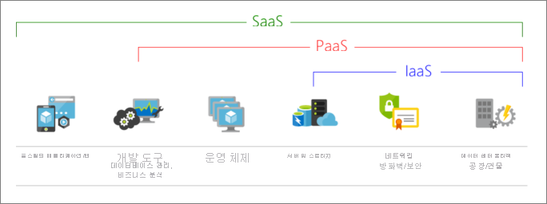
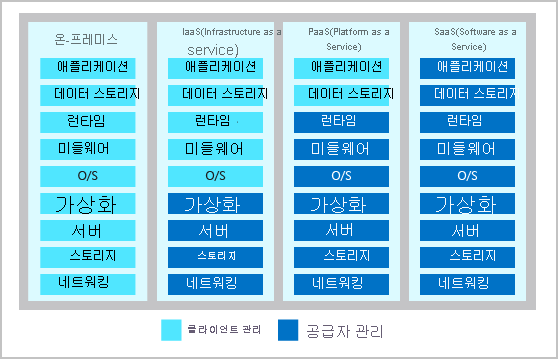
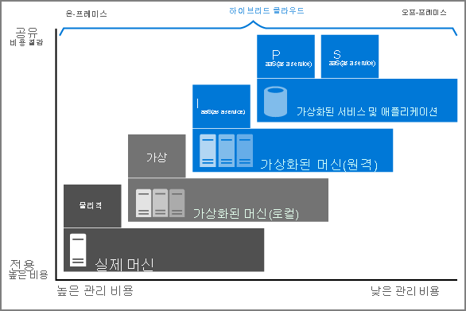

# Azure

___

## What is Cloud Computing?

pay-as-you-go

host vm

cloud-based storage(backup, secure)

deploy , and host webpage

azure functions

azure container

azure kubernetess

azure cosmos DB

intellgence

regional datacenter

azure portal figure and control service

scalability, and secure 

### 클라우드 컴퓨팅이란?

클라우드 컴퓨팅은 인터넷을 통해 컴퓨팅 서비스를 제공

이 서비스에는 서버, 스토리지, 데이터베이스, 네트워킹, 소프트웨어, 분석 및 인텔리전스 포함

클라우드 컴퓨팅은 신속한 혁신, 유연한 리소스, 규모의 경제성 제공

### 클라우드 컴퓨팅이 일반적으로 요금이 저렴한 이유는?

- 운영 비용을 절감할 수 있다.
- 인프라를 더 효율적으로 실행할 수 있다.
- 비즈니스 요구 사항 변화에 따라 크기를 조정할 수 있다.

### 클라우드로 전환해야 하는 이유는?

요즘 추세.

- IT 팀은 빠른 속도로 사용자에게 새로운 기능을 제공한다.
- 사용자는 자신의 디바이스 및 소프트웨어로 보다 다양하고 포괄적인 활용을 기대한다.

더욱 빠르게 서비스를 제공하고 혁신적이고 새로운 사용자 환경을 제공하기 위해 클라우드는 다음에 대한 주문형 액세스를 제공한다.

- 거의 제한이 없는 컴퓨팅, 스토리지 및 네트워킹 구성 요소 풀.
- 애플리케이션을 차별화하는데 도움이 되는 음성 인식 및 기타 인식 서비스
- 소프트웨어 및 디바이스에서 원격 분석 데이터를 제공하는 분석 서비스

### 클라우드 컴퓨팅의 이점은 무엇인가?

- **안정성** : 선택하는 서비스 수준 계약에 따라 클라우드 기반 애플리케이션은 문제가 발생할 경우에도 명백한 가동 중지 시간 없이 지속적인 사용자 환경을 제공한다.
- **확장성** : 클라우드 애플리케이션은 자동 스케일링을 활용하면서 다음 두 가지 방법으로 스케일링할 수 있다.
  - 수직 : 가상 머신에 RAM이나 CPU를 추가하여 컴퓨팅 용량을 늘릴 수 있다.
  - 수평 : 리소스의 인스턴스를 추가하여 컴퓨팅 용량을 늘릴 수 있다.(예를 들어 구성에 가상 머신 추가)
- **탄력성** : 클라우드 기반 애플리케이션은 필요한 리소스를 항상 갖도록 구성할 수있다.
- **민첩성** : 애플리케이션 요구 사항이 변경되면 클라우드 기반 리소스를 신속하게 배포하고 구성할 수 있다.
- **지리적 배포** : 전 세계 지역 데이터 센터에 애플리케이션 및 데이터를 배포할 수 있으므로 고객이 지역에서 항상 최고의 성능을 유지할 수 있다.
- **재해 복구** : 클라우드 기반 백업 서비스, 데이터 복제 및 지역 배포를 활용하여 재해가 발생하더라도 데이터를 안전하게 유지할 수 있으므로 애플리케이션을 안정적으로 배포할 수 있다. 

### 클라우드 서비스 모델이란 ?

클라우드 컴퓨팅은 다음 컴퓨팅 모델 중 하나에 속한다. 다양한 클라우드 서비스 모델이 존재한다.

| 컴퓨팅 모델                             | 설명                                                         |
| :-------------------------------------- | ------------------------------------------------------------ |
| IaaS (Infrastructure as a Service) | 이 클라우드 서비스 모델은 물리적 서버를 관리하는 것에 가장 가깝다. 클라우드 공급자가 하드웨어를 최신 상태로 유지하지만 운영체제 유지 관리 및 네트워크 구성은 클라우드 테넌트의 책임으로 남는다. 예를 들어  Azure Virtual Machines는 Microsoft의 데이터 센터에서 실행되는 완전히 작동하는 가상 컴퓨팅 디바이스이다. 이 클라우드 서비스 모델의 장점은 새 컴퓨팅 장치를 신속하게 배포한다는 것이다. 새 가상 머신을 설정하는 것은 물리적 서버를 구매, 설치 및 구성하는 것보다 훨씬 빠르다. |
| PaaS (Platform as a Service)       | 이 클라우드 서비스 모델은 관리형 호스팅 환경이다. 클라우드 공급자가 가상 머신 및 네트워킹 리소스를 관리하고 클라우드 테넌트가 애플리케이션을 관리형 호스팅 환경에 배포한다. Azure App Services는 개발자가 실제 하드웨어 및 소프트웨어 요구 사항을 처리할 필요 없이 웹 애플리케이션을 업로드할 수 있는 관리형 호스팅 환경을 제공한다. |
| SaaS (Software as a Service)       | 이 클라우드 서비스 모델에서 클라우드 공급자는 가상 머신, 네트워킹 리소스, 데이터 스토리지, 애플리케이션 등 애플리케이션 환경의 모든 측면을 관리한다. 클라우드 테넌트는 클라우드 공급자가 관리하는 애플리케이션에 데이터만 제공하면 된다. 예를 들어 Office  365는 클라우드에서 완전히 작동하는 버전의 Office를 제공한다. 사용자는 콘텐츠만 만들면 되고, Office 365가 다른 모든 것을 처리한다. |

다음 그림에서는 각 클라우드 서비스 모델에서 실행될 수 있는 서비스를 보여준다.

다음 차트에서는 클라우드 공급자와 클라우드 테넌트 간의 다양한 책임수준을 보여 준다.

### 서버리스 컴퓨팅이란?

PaaS와 겹치는 서버리스 컴퓨팅을 사용하면 개발자가 인프라를 관리할 필요 없이 빠르게 애플리케이션을 빌드할 수 있다. 서버리스 애플리케이션에서는 클라우드 서비스 공급자가 코드 실행에 필요한 인프라를 자동으로 프로비저닝, 스케일링 및 관리한다. 서버리스 아키텍처는 확장성이 뛰어나고 이벤트 구동 방식이다. 특정 함수 또는 트리거가 발생하는 경우에만 리소스를 사용한다.

서버리스 컴퓨팅의 정의를 이해할 때 서버에서 계속 코드를 실행하고 있다는 점에 유의해야한다. 서버리스라는 이름은 인프라 프로비저닝 및 관리와 관련된 작업이 개발자에게 표시되지 않는다는 점에서 유래한다. 이 방법을 통해 개발자는 비즈니스 논리에 더욱 집중하고 비즈니스 핵심에 더 많은 가치를 제공할 수 있다. 서버리스 컴퓨팅은 팀에서 생산성을 높이고 제품 출시를 단축하는 데 도움이 된다. 이를 통해 조직은 리소스를 보다 효율적으로 최적화하고 혁신에 집중할 수 있다.

### 퍼블릭, 프라이빗, 하이브리드 클라우드란?

클라우드 컴퓨팅의 세 가지 배포 모델은 '퍼블릭 클라우드','프라이빗 클라우드','하이브리드 클라우드'이다. 클라우드에 마이그레이션할 때는 각 배포 모델의 다른 측면을 고려해야 한다.

| 배포모델            | Description                                                  |
| ------------------- | ------------------------------------------------------------ |
| 퍼블릭 클라우드     | 서비스는 공용 인터넷을 통해 제공되고 서비스를 구매하려는 누구에게나 제공된다. 서버, 스토리지와 같은 클라우드 리소스는 타사 클라우드 서비스 공급자가 소유하고 운영하며 인터넷을 통해 제공된다. |
| 프라이빗 클라우드   | 컴퓨팅 리소스는 단일 기업 또는 조직의 사용자가 독점적으로 사용한다. 프라이빗 클라우드는 조직의 온-사이트 데이터 센터에 물리적으로 배치할 수 있다. 타사 서비스 공급자에 의해 호스트될 수도 있다. |
| 하이브리드 클라우드 | 이 컴퓨팅 환경은 퍼블릭 클라우드와 프라이빗 클라우드가 결합되어 두 클라우드 간에 데이터 및 애플리케이션을 공유할 수 있다. |

리소스를 온-프레미스에서 오프-프레미스로 이동하면 비용이 절감되고 관리 요구 사항이 감소한다.

- 온-프레미스 (On-Premise) : 클라우드 같은 개념과 대비되게 원격환경이 아닌 자체적으로 보유한 전산실 서버에 직접 설치해 운영하는 방식

- 오프-프레미스 (Off-Premise) : 온-프레미스와 대비되는 개념

