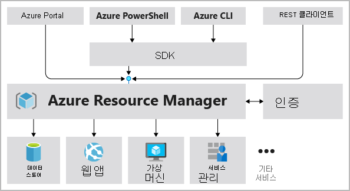

# 핵심 Azure 아키텍처 구성 요소 설명

### Azure 구독, 관리그룹, 리소스 및 지역 개요

Tailwind Traders에 대한 조사의 일환으로 Azure의 리소스에 대한 구조에 대해 알아야 한다. 이 구조에는 관리그룹, 구독, 리소스 그룹 및 리소스, 이상 4개의 수준이 있다.

- 리소스 : 리소스는 가상 머신, 스토리지 또는 SQL 데이터베이스와 같이 사용자가 만드는 서비스의 인스턴스이다.
- 리소스 그룹 : 리소스는 리소스 그룹으로 결합한다. 리소스 그룹은 웹앱, 데이터베이스, 스토리지 계정과 같은 Azure 리소스가 배포되고 관리되는 논리적 컨테이너 역할을 한다.
- 구독 : 구독은 사용자 계정과 해당 사용자 계정에서 만든 리소스를 그룹화한다. 각 구독에 대해 만들고 사용할 수 있는 리소스의 양에 대한 제한 또는 할당량이 있다. 조직에서는 구독을 사용하여 사용자, 팀 또는 프로젝트에서 만든 리소스 및 그로 인한 비용을 관리할 수 있다.
- 관리 그룹 : 이 그룹은 여러 구독에 대한 액세스, 정책 및 규정 준수를 관리하는 데 도움이 된다. 관리 그룹에 속하는 모든 구독은 관리 그룹에 적용되는 조건을 자동으로 상속한다.

### Azure 구독 및 관리 그룹

계정에는 서로 다른 청구 모델을 보유하고 다른 액세스 관리 정책을 적용하는 하나 또는 여러 개의 구독이 있을 수 있다. Azure 구독을 사용하여 Azure 제품, 서비스 및 리소스를 중심으로 경계를 정의할 수 있다. 두 가지 유형의 구독 경계를 사용할 수 있다.

- **청구 경계**: 이 구독 유형은 Azure 사용에 따른 Azure 계정 청구 방식을 결정합니다. 다양한 유형의 청구 요구 사항에 따라 여러 개의 구독을 만들 수 있습니다. Azure는 비용을 구성하고 관리할 수 있도록 각 구독에 대해 별도의 청구 보고서 및 송장을 생성합니다.
- **액세스 제어 경계**: Azure는 구독 수준에서 액세스 관리 정책을 적용하며, 다른 조직 구조를 반영하기 위해 별도의 구독을 만들 수 있습니다. 예를 들어 비즈니스 내에서 고유한 Azure 구독 정책을 적용할 수 있는 서로 다른 부서가 있습니다. 이 청구 모델을 통해 특정 구독으로 사용자가 프로비저닝하는 리소스에 대한 액세스를 제어할 수 있습니다.

### 요구 사항에 맞게 청구 사용자 지정

구독이 여러 개인 경우 청구서 섹션으로 구성할 수 있다. 각 청구서 섹션은 해당 월에 발생한 요금을 보여 주는 청구서의 품목이다. 예를 들어 조직에 대한 단일 청구서가 필요하지만 부서, 팀 또는 프로젝트별로 비용을 정리하려는 경우가 있다.

요구 사항에 따라 동일한 청구 계정 내에 여러 개의 청구서를 설정할 수 있다. 이렇게 하려면 추가 청구 프로필을 만들어야 한다. 청구 프로필마다 고유의 월간 청구서 및 결제 방법이 있다.

다음 다이어그램에서는 청구를 구성하는 방법에 대 한 개요를 보여 준다. 이전에 Azure에 가입했거나 조직에 기업계약이 있는 경우에는 청구를 다르게 설정할 수 있다.

### Azure 관리그룹

조직에 구독이 많은 경우 해당 구독에 대한 액세스, 정책 및 규정 준수를 효율적으로 관리하는 방법이 필요할 수 있다. Azure 관리 그룹은 구독 이상의 범위 수준을 제공한다. 구독을 관리 그룹이라고 하는 컨테이너에 구성하고 거버넌스 조건을 관리 그룹에 적용한다. 관리 그룹에 속하는 모든 구독은 관리 그룹에 적용되는 조건을 자동으로 상속한다. 관리 그룹은 어떤 형식의 구독을 사용하든 관계 없이 대규모의 엔터프라이즈급 관리를 제공한다. 단일 관리 그룹 내의 모든 구독은 동일한 Azure AD 테넌트를 신뢰해야 한다.

예를 들어 VM 생성에 사용할 수 있는 지역을 제한하는 정책을 관리 그룹에 적용할 수 있다. 이 정책은 해당 지역에만 VM을 만들 수 있도록 허용하는 방식으로 그 지역에 속한 모든 관리 그룹, 구독 및 리소스에 적용된다.

아래는 관리 그룹을 사용하여 거버넌스 계층 구조를 만드는 예를 보여준다. 예를 들어 프로덕션이라는 그룹에서 VM위치를 미국 서부 지역으로 제한할 수 있다.

### 관리 그룹에 대한 중요한 사실

- 단일 디렉터리에서 지원할 수 있는 관리 그룹 수는 10,000개이다.
- 관리 그룹 트리에서 지원할 수 있는 최대 깊이 수준은 6이다. 이 제한은 루트 수준 또는 구독 수준을 포함하지 않는다.
- 각 관리 그룹 및 구독은 하나의 부모만 지원할 수 있다.
- 각 관리 그룹에는 여러 자식 요소가 있을 수 있다.
- 모든 구독 및 관리 그룹은 각 디렉터리의 단일 계층 내에 위치한다.

### Azure 리소스 그룹

리소스 그룹은 Azure 플랫폼의 기본 요소이다. 리소스 그룹은 Azure에 배포된 리소스의 논리 컨테이너이다. 이러한 리소스는 VM, Azure Application Gateway 인스턴스, Azure Cosmos DB 인스턴스와 같은 Azure 구독에서 만드는 모든 항목이다. 모든 리소스는 리소스 그룹에 있어야하고 한 리소스는 단일 리소스 그룹의 멤버여야 한다. 이동에 대한 특정 제한 사항이나 요구 사항이 있는 일부 서비스를 사용하여 리소스 그룹 간에 많은 리소스를 이동할 수 있다. 리소스 그룹은 중첩할 수 없다. 리소스를 프로비전하려면 리소스를 배치할 리소스 그룹이 필요하다. 

### 논리적 그룹화

리소스 그룹의 용도는 Azure **리소스를 간편하게 관리하고 구성하는 것**이다. 사용량, 형식 또는 비슷한 리소스를 한 리소스 그룹에 배치하면 Azure에서 만드는 리소스에 질서를 부여하고 체계적으로 구성할 수 있다. 이 단원에서는 논리적 그룹화에 가장 큰 관심을 가져야 한다. 리소스가 너무 무질서하기 때문이다.

### 수명 주기

리소스 그룹을 삭제하면 그 안에 있는 리소스도 모두 삭제된다. 리소스를 수명 주기로 구성하는 방법은 실험 후 리소스를 폐기하는 개발 및 테스팅 환경에서 유용하게 사용할 수 있다. 리소스 그룹을 사용하면 리소스 세트를 한꺼번에 간편하게 제거할 수 있다.

### 권한 부여

리소스 그룹은 RBAC(역할 기반 액세스 제어) 권한을 적용하는 범위이기도 하다. 리소스 그룹에 RBAC 권한을 적용하면 관리가 간편해지고 필요한 리소스만 사용하도록 액세스를 제한할 수 있다.

### Azure 리소스 관리자

Azure Resource Manager는 Azure용 배포 및 관리 서비스이다. Azure 계정에서 리소스를 만들고, 업데이트하고, 삭제할 수 있는 관리 계층을 제공한다. 액세스 제어, 잠금, 태그와 같은 관리 기능을 사용하여 배포 후에 리소스를 보호하고 구성한다.

사용자가 Azure 도구, API 또는 SDK에서 요청을 보내면 Resource Manager에서 요청을 받는다. 요청을 인증하고 권한을 부여한다.  Resource Manager에서 요청된 작업을 수행하는 Azure 서비스에 요청을 보낸다. 모든 요청이 동일한 API를 통해 처리되므로 모든 여러 도구에서 일관적인 결과 및 기능을 볼 수 있다.

다음 이미지에서는 Azure 요청을 처리할 때 Resource Manager가 수행하는 역할을 보여준다.

### 리소스 관리자를 사용할 경우의 이점

Resource Manager를 사용하면 다음을 수행할 수 있다.

- 스크립트가 아니라 선언적 템플릿을 통해 인프라를 관리한다. Resource Manager 템플릿은 Azure에 무엇을 배포하는지 정의하는 JSON 파일이다.
- 이 리소스를 개별적으로 처리하는 대신, 솔루션의 모든 리소스를 그룹으로 배포, 관리 및 모니터링한다.
- 개발 수명 주기 내내 솔루션을 다시 배포한다(리소스가 일관된 상태로 배포됨을 확신할 수 있음).
- 리소스가 올바른 순서로 배포되도록 리소스 간의 종속성을 정의한다.
- 모든 서비스에 액세스 제어를 적용한다. RBAC가 기본적으로 관리 플랫폼에 통합되기 때문이다.
- 리소스에 태그를 적용하여 구독의 모든 리소스를 논리적으로 구성한다.
- 동일한 태그를 공유하는 리소스 그룹에 대한 비용을 확인하여 조직의 청구를 명확히 한다.

