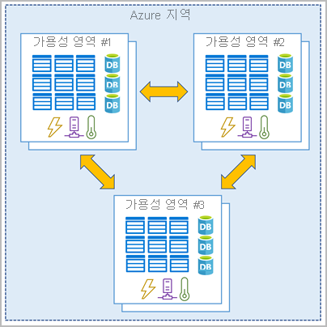

# Azure 지역 및 가용성 영역

리소스는 Azure 데이터 센터를 포함하는 전 세계 여러 지리적 위치인 지역에서 생성된다. 

Azure는 전 세계에 위치한 데이터 센터로 구성된다. SQL 데이터베이스 또는 VM(가상 머신) 같은 서비스를 사용하거나 리소스를 만들 때 데이터 센터 중 하나 이상에 위치한 물리적 장비를 사용하게 된다. 특정 데이터 센터가 사용자에게 직접 노출되지는 않지만, Azure는 이들을 지역으로 구성한다.

### Azure 지역

지역이란 가까운 곳에 있고 대기 시간이 짧은 네트워크를 통해 연결된 데이터 센터를 하나 이상 포함하고 있는 (여러 개 포함 가능) 지리적 영역을 의미한다. Azure는 각 Azure 지역의 리소스를 지능적으로 할당하고 제어하여 워크로드의 적절한 균형을 유지한다.

### 지역이 중요한 이유는 무엇입니까?

Azure는 다른 클라우드 공급 기업보다 더 많은 글로벌 지역에서 서비스를 운영한다. 따라서 사용자가 어디에 있든 사용자와 더욱 가까운 위치에서 애플리케이션을 제공할 수 있다. 글로벌 지역은 향상된 확장성 및 중복성을 제공한다. 또한 서비스의 데이터 보존을 유지한다.

### Azure 가용성 영역

장애 발생 시 정보를 보호할 수 있도록 서비스와 데이터를 중복시키려 한다. 인프라를 호스트할 때 자체적으로 중복성을 설정하려면 중복된 하드웨어 환경을 구축해야 한다. Azure는 가용성 영역을 통해 앱의 가용성을 높일 수 있다.

### 가용성 영역이란?

가용성 영역은 Azure 지역 내에서 물리적으로 분리된 데이터 센터이다. 각 가용성 영역은 독립된 전원, 냉간 및 네트워킹을 갖춘 하나 이상의 데이터 센터로 구성된다. 가용성 영역은 격리 경계로 설정된다. 한 영역이 다운되어도 다른 영역은 계속 작동한다. 가용성 영역은 고속 프라이빗 광 네트워크를 통해 연결된다.

### 앱에서 가용성 영역 사용

가용성 영역을 사용하여 중요 업무용 애플리케이션을 실행할 수 있으며, 한 영역 내에 컴퓨팅, 스토리지, 네트워킹 및 데이터 리소스를 공동 배치하고 다른 영역에 복제하여 애플리케이션 아키텍처에 고가용성을 구현할 수 있다. 서비스를 중복시키고 영역 간에 데이터를 전송하는 비용이 발생할 수 있다는 점을 기억하자.

가용성 영역은 주로 VM, 관리 디스크, 부하 분산 장치 및 SQL 데이터베이스에 주로 사용된다. 가용성 영역을 지원하는 Azure 서비스는 다음 두 가지 범주로 나뉜다.

- **영역 서비스**: 특정 영역(예: VM, 관리 디스크, IP 주소)에 리소스를 고정한다.
- **영역 중복 서비스**: 플랫폼이 영역에서 자동으로 복제됩니다(예: 영역 중복 스토리지, SQL 데이터베이스).

설명서를 통해 가용성 영역에 연결할 수 있는 아키텍처 요소를 확인하자.

### Azure 지역 쌍

가용성 영역은 하나 이상의 데이터 센터를 사용하여 만들어진다. 단일 지역에는 최소 세 개의 영역이 있다. 두 데이터 센터 모두 중단될 수 있는 대규모 재해가 발생할 수도 있습니다. 이러한 이유로 Azure는 항상 *Azure 지역 쌍* 을 만든다.

### Azure 지역 쌍이란?

각 Azure 지역은 300마일 이상 떨어져 있는 동일한 지리적 위치(예: 미국, 유럽 또는 아시아) 내의 다른 Azure 지역과 항상 쌍을 이룬다. 이 방법을 통해 한 지리적 위치에서 VM 스토리지 같은 리소스를 복제할 수 있으며, 이렇게 하면 두 Azure 지역에 동시에 영향을 주는 자연재해, 내전, 정전 또는 물리적 네트워크 중단 등의 이벤트 때문에 서비스가 중단될 가능성을 줄일 수 있다. 예를 들어, 한 쌍의 지역이 자연재해의 영향을 받은 경우 서비스는 해당 지역 쌍의 다른 지역으로 자동으로 장애 조치(failover)된다.

Azure 지역 쌍의 예로는 미국 동부와 미국 서부 쌍, 동남 아시아와 동아시아 쌍이 있다.

Azure 지역 쌍의 추가적인 이점은 다음과 같다.

- 광범위한 Azure 중단이 발생하는 경우 해당 지역 쌍에서 호스트되는 애플리케이션에 대해 하나 이상의 지역이 가능한 한 빨리 복원되도록 하기 위해 모든 쌍 중에서 하나의 지역이 우선하도록 지정된다.
- 계획된 Azure 업데이트는 가동 중지 및 애플리케이션 중단 위험을 최소화하기 위해 한 번에 한 Azure 지역 쌍으로 롤아웃된다.
- 데이터는 세금 및 법률 집행 관할 구역에 사용될 수 있게 동일한 지리적 위치 내에 쌍으로(브라질 남부 제외) 상주합니다.

광범위하게 분산된 데이터 센터 세트를 사용하면 Azure가 높은 가용성을 보장한다.