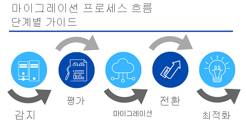

# Azure Database 및 분석 서비스

### 1. Azure Cosmos DB

Azure Cosmos DB는 전 세계에 배포된 다중 모델 데이터베이스 서비스입니다. 전 세계 여러 Azure 지역에서 처리량 및 스토리지를 탄력적이고 독립적으로 스케일링할 수 있습니다. 많이 사용되는 여러 API 중 하나를 사용하여 한 자릿수 밀리초의 빠른 데이터 액세스를 활용할 수 있습니다. Azure Cosmos DB는 처리량, 대기 시간, 가용성 및 일관성 보장을 위해 포괄적인 서비스 수준 약정을 제공합니다.

Azure Cosmos DB는 지속적으로 변경되는 데이터를 지원하기 위해 응답성이 뛰어난 “Always On” 애플리케이션을 빌드할 수 있는 스키마 없는 데이터를 지원합니다. 이 기능을 사용하여 전 세계 사용자가 업데이트하고 유지 관리하는 데이터를 저장할 수 있습니다.

예를 들어 Tailwind Traders는 전 세계의 고객이 Tailwind Traders가 만드는 다양한 도구에 대해 배우는 데 사용하는 퍼블릭 교육 포털을 제공합니다. Tailwind Traders 개발자는 데이터를 유지 관리 및 업데이트합니다. 다음 일러스트레이션은 Tailwind Traders 교육 포털 웹 사이트용 데이터를 저장하는 데 사용되는 샘플 Azure Cosmos DB 데이터베이스를 보여 줍니다.

Azure Cosmos DB는 유연합니다. Azure Cosmos DB는 가장 낮은 수준에서 ARS(아톰-레코드-시퀀스) 형식으로 데이터를 저장합니다. 그런 다음, 데이터를 추상화하고 API로 프로젝션하여 데이터베이스를 작성할 때 이를 지정합니다. SQL, MongoDB, Cassandra, Tables, Gremlin을 선택할 수 있습니다. 이 수준의 유연성은 회사의 데이터베이스를 Azure Cosmos DB로 마이그레이션할 때 개발자가 가장 편안한 API를 계속 사용할 수 있음을 의미합니다.

### 2. Azure SQL DB

Azure SQL Database는 Microsoft SQL Server 데이터베이스 엔진의 최신 안정화 버전을 기반으로 하는 관계형 데이터베이스입니다. SQL Database는 안정적이고 안전하며 고성능을 제공하는 완전 관리형 데이터베이스입니다. 인프라를 관리할 필요 없이 선택한 프로그래밍 언어로 데이터 기반 애플리케이션 및 웹 사이트를 빌드하는 데 사용할 수 있습니다.

Azure SQL Database는 PaaS(Platform as a Service) 데이터베이스 엔진입니다. 사용자 개입 없이 업그레이드, 패치, 백업 및 모니터링과 같은 대부분의 데이터베이스 관리 기능을 처리합니다. SQL Database는 99.99% 가용성을 제공합니다. SQL Database에 기본 제공되는 PaaS 기능 덕분에 비즈니스에 중요한 도메인 특정 데이터베이스 관리 및 최적화 활동에 집중할 수 있습니다. SQL Database는 기본 제공되는 고가용성, 백업 및 다른 일반적인 유지 관리 작업이 포함된 완전 관리형 서비스입니다. Microsoft는 SQL 및 운영 체제 코드에 대한 모든 업데이트를 처리합니다. 기본 인프라를 관리할 필요가 없습니다.

Azure의 애플리케이션 및 솔루션을 위한 고가용성 고성능 데이터 스토리지 계층을 만들 수 있습니다. SQL Database는 그래프, JSON, 공간, XML과 같은 관계형 데이터와 비관계형 구조를 모두 처리할 수 있기 때문에 다양한 최신 클라우드 애플리케이션을 위한 적합한 선택일 수 있습니다.

고성능 메모리 내 기술 및 인텔리전트 쿼리 처리와 같은 고급 쿼리 처리 기능을 사용할 수 있습니다. 실제로 SQL Server의 최신 기능은 먼저 SQL Database에 릴리스된 후 SQL Server 자체에 릴리스됩니다. 수백만 개의 데이터베이스에서 테스트된 최신 SQL Server 기능을 업데이트 또는 업그레이드를 위한 오버헤드 없이 활용할 수 있습니다.

## 마이그레이션

Tailwind Traders는 현재 퍼블릭 웹 사이트(예: 고객 데이터, 주문 기록 및 제품 카탈로그)용 데이터 스토리지를 제공하는 SQL Server를 실행하는 여러 온-프레미스 서버를 사용합니다. 또한 SQL Server를 실행하는 온-프레미스 서버는 내부 전용 교육 포털 웹 사이트용 데이터 스토리지도 제공합니다. Tailwind Traders는 새 직원 교육 자료(예: 연구 자료, 인증 세부 정보 및 교육 증명서)에 대한 웹 사이트를 사용합니다. 다음 일러스트레이션은 회사가 Azure SQL Database 교육 포털 웹 사이트에 저장할 수 있는 데이터의 형식을 보여 줍니다.

Azure Database Migration Service를 사용하여 최소한의 가동 중지 시간으로 기존의 SQL Server 데이터베이스를 마이그레이션할 수 있습니다. Microsoft Data Migration Assistant는 마이그레이션을 수행하기 전에 필요한 변경 사항을 설명하는 권장 사항을 제공하는 평가 보고서를 생성할 수 있습니다. 필요한 수정을 평가하고 해결한 후 마이그레이션 프로세스를 시작할 수 있습니다. Azure Database Migration Service가 필요한 모든 단계를 수행합니다. 앱에서 연결 문자열만 변경해주면 됩니다.

Tailwind Traders는 마이그레이션의 일환으로 Azure SQL Database를 선택했다.

쿼리 실행 성공!

### 3. Azure SQL Managed Instance 살펴보기

Azure SQL Managed Instance는 완전 관리형 PaaS(Platform as a Service)의 모든 이점과 함께 가장 광범위한 SQL Server 데이터베이스 엔진 호환성을 제공하는 확장성 있는 클라우드 데이터 서비스입니다. 시나리오에 따라 Azure SQL Managed Instance는 데이터베이스 요구 사항을 위한 추가 옵션을 제공할 수 있습니다.

## 기능

Azure SQL Database와 마찬가지로 Azure SQL Managed Instance는 PaaS(Platform as a Service) 데이터베이스 엔진입니다. 즉, 회사는 완전 관리형 환경에서 데이터를 클라우드로 이동하는 최상의 기능을 활용할 수 있습니다. 예를 들어 회사는 더 이상 비싼 하드웨어를 구매하고 관리할 필요가 없으며 온-프레미스 인프라를 관리하는 추가적인 오버헤드를 유지 관리할 필요가 없습니다. 반면, 회사는 자동화된 패치 및 버전 업그레이드와 함께 Azure의 신속한 프로비전 및 서비스 스케일링 기능을 활용할 수 있습니다. 또한 기본 제공 고가용성 기능과 99.99%의 가동 시간 SLA(서비스 수준 약정)를 통해 필요할 때 데이터를 항상 사용할 수 있다는 것을 확신할 수 있습니다. 또한 자동화된 백업 및 구성 가능한 백업 보존 기간을 사용하여 데이터를 보호할 수 있습니다.

Azure SQL Database 및 Azure SQL Managed Instance는 많은 동일한 기능을 제공하지만, Azure SQL Managed Instance는 Azure SQL Database에서 사용할 수 없는 몇 가지 옵션을 제공합니다. 예를 들어 Tailwind Traders는 현재 SQL Server를 실행하는 온-프레미스 서버를 여러 대 사용하며, 기존 데이터베이스를 클라우드에서 실행되는 SQL 데이터베이스로 마이그레이션하려고 합니다. 그러나 여러 데이터베이스에서 데이터 정렬에 키릴 자모 문자를 사용합니다. 이 시나리오에서 Azure SQL Database는 기본 `SQL_Latin1_General_CP1_CI_AS` 서버 데이터 정렬만 사용하므로 Tailwind Traders는 데이터베이스를 Azure SQL Managed Instance로 마이그레이션해야 합니다.

## 마이그레이션

Azure SQL Managed Instance를 사용하면 Azure DMS(Database Migration Service)나 네이티브 백업 및 복원을 사용하여 SQL Server의 온-프레미스 데이터를 클라우드로 쉽게 마이그레이션할 수 있습니다. 회사에서 사용하는 모든 기능을 검색한 후 Azure SQL Managed Instance로 마이그레이션할 수 있는 온-프레미스 SQL Server 인스턴스를 평가하여 차단 문제가 있는지 확인해야 합니다. 문제를 해결한 후에는 데이터를 마이그레이션한 다음, 애플리케이션에서 연결 문자열을 변경하여 온-프레미스 SQL Server에서 Azure SQL Managed Instance로 전환할 수 있습니다.

### 4. Azure Database for MySQL 살펴보기

Tailwind Traders는 현재 **LAMP 스택**(Linux, Apache, MySQL, PHP)을 사용하는 여러 웹 사이트를 온-프레미스에서 관리합니다. 마이그레이션 전략을 계획하는 과정에서 Tailwind Traders의 여러 팀은 Azure에서 제공하는 가용 서비스 제공 사항을 연구해 왔습니다. Azure App Service의 Web Apps 기능이 Apache를 실행하는 Linux 서버에서 PHP를 사용하는 웹 애플리케이션을 만드는 기본 제공 기능을 제공하는 것을 이미 발견했습니다. Azure로 마이그레이션한 후에도 웹 개발 팀의 데이터베이스 요구 사항이 계속 충족될지 여부를 조사하는 작업을 진행했습니다.

Azure Database for MySQL은 클라우드의 관계형 데이터베이스 서비스이며 MySQL Community Edition 데이터베이스 엔진 5.6, 5.7 및 8.0 버전을 기반으로 한다. 이 서비스와 함께 Microsoft 관리형 데이터 센터의 글로벌 네트워크에서 제공하는 Azure의 99.99% 가용성 서비스 수준 약정이 제공된다. 이 덕분에 앱을 연중무휴로 계속 실행할 수 있다. 

기존 LAMP 스택 애플리케이션을 위한 논리적인 선택이다.

다른 방법으로 구입 또는 설계, 구축 및 관리해야 할 수도 있는 기본 제공 보안, 내결함성 및 데이터 보호를 모든 MySQL 서버용 Azure Database에서 활용한다. MySQL용 Azure Database에서 특정 시점 복원을 사용하여 서버를 최대 35일 전의 상태로 복원할 수 있다.

주요 기능은 다음과 같다.

- 추가 비용 없이 기본 제공되는 고가용성
- 예측 가능한 성능 및 포괄적인 종량제 가격 책정
- 필요에 따라 몇 초 만에 스케일링
- 중요한 미사용 데이터 및 사용 데이터 보호 기능
- 자동 백업
- 엔터프라이즈급 보안 및 규정 준수

이러한 기능에는 인증이 필요하지 않고 추가 비용 없이 제공된다. 해당 기능을 사용하면 가상 머신 및 인프라를 관리하는 대신 신속한 앱 개발 및 출시 기간 단축에 집중할 수 있다. 또한 Azure Database Migration Service를 사용하여 최소한의 가동 중지 시간으로 기존의 MySQL 데이터베이스를 마이그레이션할 수 있다. 마이그레이션을 완료한 후에는 선택한 오픈 소스 도구 및 플랫폼을 사용하여 애플리케이션을 계속 개발할 수 있다. 새 기술을 배울 필요 없이 말이다!!

### 5. Azure Databse for PostgreSQL 살펴보기

Tailwind Traders는 전체 데이터 전략에 따라 몇 년간 PostgreSQL을 사용해 왔다. 클라우드로 이동하기 전에 온-프레미스 서버에서 누리던 것과 동일한 이점을 얻을 수 있기를 원한다.

Azure Database for PostgreSQL은 클라우드의 관계형 데이터베이스 서비스이다. 서버 소프트웨어는 커뮤니티 버전의 오픈 소스 PostgreSQL 데이터베이스 엔진을 기반으로 한다. Azure Databse for PostgreSQL을 사용하는 동안에는 여러 도구를 사용한 경험과 PostgreSQL에 대한 전문 지식을 활용할 수 있다.

뿐만 아니라 Azure Databse for PostgreSQL은 다음과 같은 이점을 제공한다.

- 온-프레미스 리소스에 비해 높은 기본 고가요엉. 애플리케이션 가용성을 유지하기 위한 추가 구성, 복제 또는 비용이 필요 없다.
- 단순하고 유연한 가격 책정. 소프트웨어 패치, 자동 백업, 모니터링 및 보안이 포함된 가격 책정 계층 중 선택하는 계층에 따라 예측 가능한 성능을 얻을 수 있다.
- 필요에 따라 몇 초 만에 스케일 업 또는 스케일 다운한다. 필요한 대로 컴퓨팅 또는 스토리지 규모를 독립적으로 조정하여 사용량에 맞게 서비스를 조정할 수 있다.
- 조정 가능한 자동 백업 및 특정 시점 복원(최대 35일)
- 엔터프라이즈급 보안 및 규정 준수를 통해 중요한 미사용 데이터 및 사용 중인 데이터를 안전하게 보호. 이 보안은 디스크의 데이터 암호화 및 클라이언트와 서버 통신 간 SSL암호화에 적용된다.

Azure Database for PostgreSQL은 두 배포 옵션, 즉 **단일 서버** 및 **하이퍼스케일(Citus)** 로 사용할 수 있다.

**단일 서버**

단일 서버 배포 옵션은 다음과 같은 이점을 누릴 수 있다.

- 추가 비용 없이 기본 제공되는 고가용성(99.99% SLA)
- 예측 가능한 성능 및 포괄적인 종량제 가격 책정
- 필요에 따라 몇 초 만에 수직적 스케일링
- 서버를 평가하기 위한 모니터링 및 경고
- 엔터프라이즈급 보안 및 규정 준수
- 중요한 미사용 데이터 및 사용 데이터 보호 기능
- 최대 35일 동안 자동 백업 및 지정 시간 복원

이러한 모든 기능에는 인증이 필요하지 않고 추가 비용 없이 제공된다. 가상 머신 및 인프라를 관리하는 대신 신속한 애플리케이션 개발 및 출시 기간 단축에 집중할 수 있다. 새로운 기술을 습득하지 않고도 원하는 오픈 소스 도구와 플랫폼을 사용하여 애플리케이션을 계속 개발할 수 있다.

단일 서버 배포 옵션에서 제공하는 세 가지 가격 책정 계층은 기본, 범용 및 메모리 최적화의 세 가지 가격 책정 계층 중 하나에서 만들 수 있다. 각 계층에서는 데이터베이스 작업을 지원하는 다양한 리소스 기능을 제공한다. 한 달에 몇 달러로 작은 데이터베이스에 첫 번째 앱을 빌드하고 솔루션의 요구에 맞게 규모를 조정할 수 있다. 동적 확장성을 사용하면 데이터베이스가 빠르게 변화하는 리소스 요구 사항에 투명하게 대응할 수 있다. 필요할 경우 필요한 리소스에 대해서만 요금을 지불한다.

**하이퍼스케일(Citus)**

하이퍼스케일(Citus) 옵션은 분할을 사용하여 여러 머신에 걸쳐 쿼리를 수평으로 스케일링한다. 쿼리 엔진은 들어오는 SQL 쿼리를 이러한 서버 간에 병렬 처리하여 큰 데이터 세트에서 더 빠르게 응답한다. 이 옵션은 더 뛰어난 스케일링과 성능이 필요한 애플리케이션, 일반적으로 100GB의 데이터에 이르거나 이미 초과한 워크로드를 처리한다.

하이퍼스케일(Citus) 배포 옵션은 다중 테넌트 애플리케이션, 실시간 운영 분석 및 높은 처리량 트랜잭션 워크로드를 지원한다. PostgreSQL용으로 빌드된 애플리케이션은 표준 연결 라이브러리 및 최소한의 변경을 통해 하이퍼스케일(Citus)에서 분산 쿼리를 실행할 수 있다.

# 빅 데이터 및 분석 살펴보기

### Tailwind Traders 사는 빅 데이터가 왜 필요한가?

몇 년 전 Tailwind Traders는 모든 배달 차량을 위한 새로운 GPS 추적 시스템을 출시했습니다. 새 시스템은 기본 데이터 센터에 실시간 추적 데이터를 제공합니다. CTO는 추세를 파악하기 위해 팀이 몇 년간의 추적 데이터를 확인하기를 원합니다. 예를 들어 휴일 배달이 급증하는 중요한 추세로 인해 추가 직원을 고용해야 할 수 있습니다. 기록한 추적 데이터의 심층 분석을 통해 CTO는 변경이 필요한 시기를 예측하고 급격한 증가를 적절하게 관리하는 데 필요한 조치를 취하려고 합니다.

데이터는 모든 형태의 양식과 형식으로 제공됩니다. 빅 데이터란 ‘대량’의 데이터를 말합니다. 이 Tailwind Traders 시나리오에서는 GPS 센서에서 위치 정보를 비롯한 데이터뿐만 아니라 날씨 시스템 또는 대량의 데이터를 생성하는 다양한 다른 소스에서 비롯된 데이터도 수집됩니다. 이 정도 양의 데이터는 파악하는 것뿐만 아니라 이를 기반으로 하여 결정을 내리기도 점점 더 어려워집니다. 용량이 너무 커서 일반적인 형태의 처리 및 분석은 더 이상 적합하지 않습니다.

대규모 데이터 세트를 처리하기 위해 점차 오픈 소스 클러스터 기술이 개발되었습니다. Microsoft Azure는 Azure Synapse Analytics, Azure HDInsight, Azure Databricks 및 Azure Data Lake Analytics를 포함하여 빅 데이터 및 분석 솔루션을 제공하는 광범위한 기술 및 서비스를 지원합니다.

___

